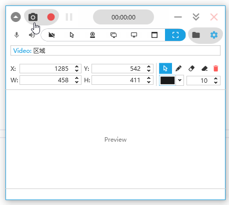
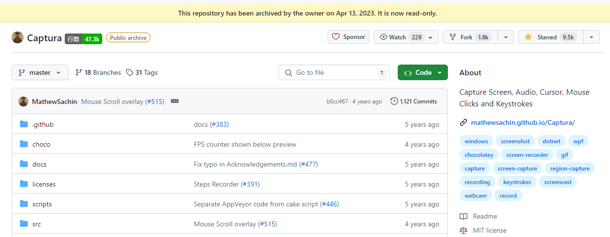

[](LICENSE.md)


&copy; [Copyright 2019](mathew/LICENSE_MathewSachin.md) Mathew Sachin
&copy; [Copyright 2024](LICENSE.md) Mr. Chip

To read the story of **Capture** in following
:link: <https://mathewsachin.github.io/Captura/>

Capture Screen, WebCam, Audio, Cursor, Mouse Clicks and Keystrokes.





I also learned about the program **Captura** from chatting room. [Captura](https://github.com/MathewSachin/Captura) was first developed as an open source program first initiated by **Mathew Sachin**. But the author eventually abandoned the development and maintenance of this software due to some unpleasant experiences ([#406](https://github.com/MathewSachin/Captura/issues/405)) and a shift in interest ([#570](https://github.com/MathewSachin/Captura/issues/570)).




Looking at the Github code stats, the entire repository probably has less than **50k** lines of code. In the spirit of learning, I cloned this repository and found that it compiles directly on Visual Studio 2022, which is still very nice. During the period I also found some software bugs. this is a good software, it is a pity to be discontinued. So I want to have the opportunity to take over the maintenance of this software, so I made a fork [mrchipset/nCaptura](https://github.com/mrchipset/nCaptura) to start my modification.

I changed the repository name to **nCaptura**, which means `new-Captura`. Hopefully, it will lead to a new trip for this project.


## Features

- Take ScreenShots
- Capture ScreenCasts (Avi/Gif/Mp4)
- Capture with/without Mouse Cursor
- Capture Specific Regions, Screens or Windows
- Capture Mouse Clicks or Keystrokes
- Mix Audio recorded from Microphone and Speaker Output
- Capture from WebCam.
- Can be used from [Command-line](https://mathewsachin.github.io/Captura/cmdline) (*BETA*).
- Available in [multiple languages](https://mathewsachin.github.io/Captura/translation)
- Configurable [Hotkeys](https://mathewsachin.github.io/Captura/hotkeys)

## Installation
Installation package `nCaptura` is coming soon.
To install the original `Captura`. Please find the information following.

[latest]: https://github.com/MathewSachin/Captura/releases/latest

Portable and Setup builds for the latest release can be downloaded from [here][latest].

### Chocolatey

```powershell
choco install captura -y
```

### Dev Builds

See the [Continuous Integration page](docs/CI.md).

## Docs
[Build Notes](docs/Build.md) | [System Requirements](docs/System-Requirements.md) | [Contributing](CONTRIBUTING.md)

[ScreenShots](docs/Screenshots) | [Command-line](docs/Cmdline/README.md) | [Hotkeys](https://mathewsachin.github.io/Captura/hotkeys)

[FAQ](docs/FAQ.md) | [Code of Conduct](CODE_OF_CONDUCT.md) | [Changelog](docs/Changelogs/README.md)

[Continuous Integration](docs/CI.md) | [FFmpeg](docs/FFmpeg.md)

## License

[MIT License](LICENSE.md)

Check [here](licenses/) for licenses of dependencies.
